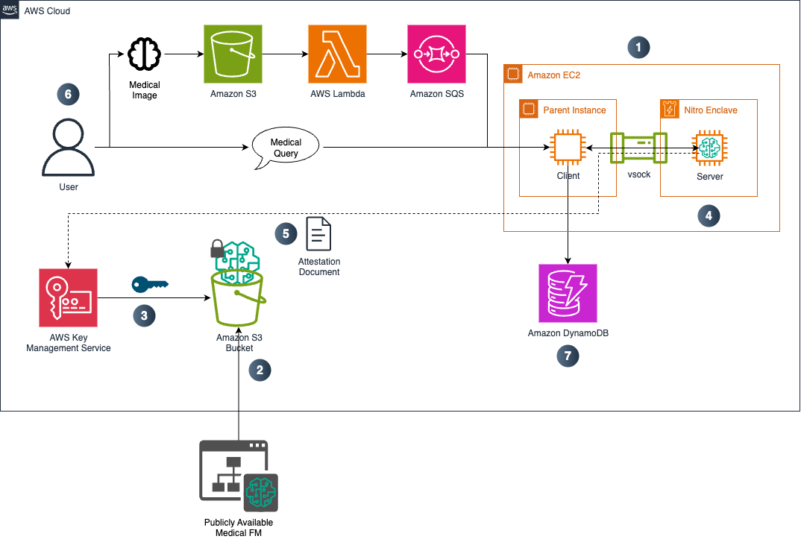

# Building Zero-Trust Healthcare Generative AI Applications with AWS Nitro Enclaves

This project demonstrates how medical LLMs can be securely published and consumed using **AWS Nitro Enclaves**. It enables **model owners** to protect their intellectual property while allowing **model consumers** to run private healthcare inferences on sensitive data within their own AWS account. This design establishes a **zero-trust boundary** between the model publisher and the healthcare organization consuming the model.

## ⚠️ Security Disclaimer

This project is provided for educational and demonstration purposes only and is not production-ready. It should not be used in any real-world clinical, diagnostic, or medical decision-making setting. The outputs generated by this system are not validated for clinical accuracy and must not be relied upon for patient care or diagnosis.

Before deploying in any production or healthcare environment, you must implement comprehensive security, privacy, and compliance safeguards, including but not limited to:
- Rigorous input validation, output filtering, and rate limiting.
- Implementation of HIPAA, PIPEDA, or other applicable health data protection controls if processing Protected Health Information (PHI).
- Use of enterprise-grade secrets management and security monitoring.
- Regulatory compliance validation and independent risk assessment.

Organizations should consult qualified healthcare compliance experts, clinical safety officers, security specialists, and legal counsel to ensure all applicable laws, ethical standards, and regulatory frameworks are met before any real-world use.

## Overview

When AI is applied in healthcare, oftentimes a scenario arises that involves two distinct parties:

- **Model Owner**: Develops a machine learning model with proprietary weights, architecture, and pre-training investments.
- **Model Consumer**: Runs the model in a secure Nitro Enclave on their own patient or operational data (e.g., diagnostic images, clinical notes, or discharge summaries).

This dynamic creates two competing risks:

1. The **model owner** must protect their intellectual property (weights, architectures, fine-tuned data) from being exfiltrated by consumers.
2. The **model consumer** must guarantee that their sensitive prompts, PHI, and results never leave their AWS environment or get exposed to the model owner.

Without the right security controls, these risks can block adoption of powerful medical AI models.

## How AWS Nitro Enclaves Helps

This solution leverages **AWS Nitro Enclaves**, which provide isolated, attested, and cryptographically verified environments for secure compute. By using AWS Nitro Enclaves, both parties achieve their requirements:

- **Model confidentiality**:

  - The model is encrypted at rest with **AWS KMS**.
  - Only an AWS Nitro Enclave that can provide a valid attestation document is authorized to decrypt the model.
  - This ensures the model can run, but cannot be extracted or reused outside the Nitro Enclave.

- **Data confidentiality**:

  - The model consumer’s sensitive input data and outputs are processed entirely inside the Nitro Enclave within their AWS account.
  - The model owner has no access to the underlying model weights.
  - Data never leaves the Nitro Enclave unless explicitly allowed by the consumer’s IAM policy.

- **Attestation and trust**:
  - AWS Nitro Enclaves produce attestation reports signed by AWS hardware that prove the Nitro Enclave is running the expected code.
  - Consumers can validate that no backdoors exist in the runtime environment before sending data to the model.

## Architecture Considerations

- The **AWS Nitro Enclave image** contains only the runtime environment and inference code - no model IP is embedded.
- The model artifacts are retrieved at runtime and decrypted inside the Nitro Enclave using KMS.
- Only essential interfaces are exposed:
  - **AWS KMS** for secure key handling.
  - **Amazon S3** for encrypted model artifact storage.
  - **LLM inference endpoint** for request/response.
  - **IMDSv2** for Nitro Enclave identity and attestation workflows.
- Networking and I/O are strictly minimized to reduce attack surface.

## About MedGemma 4B

[Google MedGemma 4B](https://deepmind.google/models/gemma/medgemma/) is a specialized, multimodal large language model built on top of **Google’s Gemma 3** family and **instruction-tuned** specifically for healthcare scenarios. It combines domain-specific pretraining with fine-tuning for medical reasoning, making it suitable for research and clinical support tasks. A deeper overview is available [here](https://huggingface.co/google/medgemma-4b-it).

In this project, **MedGemma 4B** serves as a **reference medical LLM** that demonstrates how sensitive models can be securely deployed in **AWS Nitro Enclaves** while protecting both **model intellectual property** and **consumer data confidentiality**.

## Architecture



## Solution Workflow

The solution implements a secure end-to-end pipeline that enables **zero-trust medical LLM inference** with AWS Nitro Enclaves. Each step ensures that both the **model owner’s intellectual property** and the **consumer’s sensitive data** remain protected.

For demonstration purposes, this solution is deployed in a **single AWS account**. Ideally, in production, it would be deployed **across separate AWS accounts** - one for the **model owner** and one for the **model consumer**. Using **cross-account IAM permissions** and **encrypted model sharing via AWS KMS**, the model owner can securely provide access to their model without exposing the underlying weights or logic, while the consumer can run sensitive inferences within their own environment, maintaining strict data privacy and zero-trust principles.

### Steps

1. #### EC2 Setup:
    An **Amazon EC2 instance** is launched with **AWS Nitro Enclaves** and **TPM (Trusted Platform Module)** enabled. For this project, a **C7i.12xlarge** instance is used to provide the necessary compute resources for running large language models. The Nitro Enclave partition isolates memory and CPU cores from the host instance, ensuring strong runtime separation.

2. #### Model Download: 
   The **open-source MedGemma 4B model** is retrieved from [HuggingFace](https://huggingface.co/google/medgemma-4b-it) and stored in an **Amazon S3 bucket** within the model consumer’s AWS account. This ensures that the model artifacts are both available for inference and fully controlled by the consumer.

3. #### Encryption:  
   The model is encrypted using **AWS KMS envelope encryption**. Only Nitro Enclaves presenting a valid attestation document can request the decryption key from AWS KMS, which prevents unauthorized access to the model weights outside the Nitro Enclave.

4. #### AWS Nitro Enclave Build:
   A **Docker image** containing the **llama.cpp inference runtime** is built and deployed inside the Nitro Enclave. The Nitro Enclave contains no model weights by default - only the runtime environment and inference server - which ensures that the Nitro Enclave image is transparent and inspectable by consumers prior to execution.

5. #### Decryption and Model Loading:  
   Once the Nitro Enclave is launched, it requests decryption of the model artifacts using its attestation credentials. The model is then securely decrypted **inside the Nitro Enclave's memory** and loaded by the **llama.cpp server**, meaning the decrypted model weights are never visible outside the Nitro Enclave boundary.

6. #### Medical Query:  
   Users can submit either **text or image-based queries** to the model. Queries are sent via **vsock**, a secure communication channel from the client application to the model server inside the Nitro Enclave. Image queries require users to upload images (such as radiology scans or pathology slides) to an **Amazon S3 bucket**. The upload event triggers an **Amazon SQS queue**, which signals the Amazon EC2 parent to fetch and send the image to the Nitro Enclave image for MedGemma to process with its multimodal capabilities. In both cases, responses are generated entirely within the Nitro Enclave and securely returned to the user.

7. #### Message History: 
   Each interaction, including the user’s prompt and the model’s response, is logged into a **Amazon DynamoDB** table. This provides a persistent conversation history that enables traceability and auditing while keeping PHI securely stored within the consumer’s account.

## Prerequisites

- AWS CLI configured with appropriate permissions
- AWS account with access to Amazon EC2 instances and Nitro Enclaves
- Knowledge of Amazon S3, AWS KMS, Amazon SQS, AWS Lambda, and Amazon DynamoDB
- Basic knowledge of AWS Nitro Enclaves and healthcare data security

## Components

### Infrastructure Scripts (`scripts/`)

1. **`create_ec2.sh`** - Creates an Amazon EC2 instance with Nitro Enclaves enabled (C7i.12xlarge).
2. **`envelope_encrypt_model.sh`** - Downloads and encrypts MedGemma 4B model using AWS KMS envelope encryption.
3. **`build_app.sh`** - Builds the llama.cpp container with MedGemma 4B.
4. **`build_enclave.sh`** - Creates the Nitro Enclave image from Docker container.
5. **`test_services.sh`** - Tests proxy services and connectivity.
6. **`lambda_function.py`** - AWS Lambda function to process an image uploaded to Amazon S3, convert it to base64, and send to an Amazon SQS queue.

### Runtime Components

- **`client/client.sh`** - Configures services and launches the secure Nitro Enclave.
- **`client/image_processor.py`** - A Python script to run an Amazon SQS queue listener that processes and sends base64 images to MedGemma.
- **`client/direct_query.py`** - A Python script to send text-based queries to MedGemma.
- **`server/run.sh`** - Main server script that runs MedGemma 4B inside the Nitro Enclave.
- **`run_complete_setup.sh`** - Automated end-to-end setup script.

## Usage

### Instructions

1. **Create an Amazon S3 Bucket for images:**  
   Go to the AWS Console, open the S3 service, and create a new bucket. Give it a unique name (ex. `AWSACCOUNTNUMBER-medgemma-image-inputs`) and use the same region as your other project resources.

2. **Create an Amazon S3 Bucket for model:**  
   Go to the AWS Console, open the Amazon S3 service, and create a new bucket. Give it a unique name (ex. `AWSACCOUNTNUMBER-medgemma-model`) and use the same region as your other project resources. Update the `S3_BUCKET_NAME` variable in `envelope_encrypt_model.sh` and `run.sh`.

3. **Create an Amazon SQS queue:**  
   Go to the AWS Console, open the Amazon SQS service, and create a new queue. Select **Standard Queue**, provide a name, leave the rest as default, and click **Create queue**. Replace the `SQS_QUEUE_URL` variable in `image_processor.py` and `lambda_function.py` (in `client` and `assets` folder, respectively) with your URL.

4. **Create an Amazon DynamoDB table:**
   Go to the AWS Console, open the Amazon DynamoDB service, and create a new table. Make its partition key `ID` as a String type. Replace the `TABLE_NAME` variable with the table name and `REGION` variable with your region in `direct_query.py` and `image_processor.py` files.

5. **Create an AWS Lambda Function:**  
   Go to the AWS Console, open the AWS Lambda service, and create a new function. Choose a name, select a runtime (e.g., Python 3.13), and paste in the Lambda function code from the `assets` folder. Next, update the Lambda function's IAM role under **Permissions** in the **Configuration** tab with access to your Amazon S3 image bucket and the Amazon SQS queue you created with inline policy permissions (see policies to attach below). Finally, within the AWS Lambda Designer, add a trigger, choose Amazon S3, and select your image bucket.

   - Amazon S3 policy:

   ```
   {
    "Version": "2012-10-17",
    "Statement": [
        {
            "Sid": "Statement1",
            "Effect": "Allow",
            "Action": [
                "s3:*"
            ],
            "Resource": [
                "arn:aws:s3:::<IMAGE_BUCKET_NAME>",
                "arn:aws:s3:::<IMAGE_BUCKET_NAME>/*"
            ]
        }
    ]
   }
   ```

   - Amazon SQS policy:

   ```
   {
    "Version": "2012-10-17",
    "Statement": [
        {
            "Sid": "VisualEditor0",
            "Effect": "Allow",
            "Action": "sqs:ListQueues",
            "Resource": "*"
        },
        {
            "Sid": "VisualEditor1",
            "Effect": "Allow",
            "Action": "sqs:*",
            "Resource": "arn:aws:sqs:<REGION>:<ACCOUNT_NUMBER>:<QUEUE_NAME>"
        }
    ]
   }
   ```

6. **Create KMS Key:**
   Go to AWS KMS, create a Symmetric key called `AppKmsKey`. Leave the default settings and click Create. Replace the `REGION` variable in `vsock-proxy.yaml` in the `client` folder with your region.

7. Clone this repository to your local machine

8. Run `./create_ec2.sh` to create the EC2 instance

   ```
   cd scripts
   chmod +x create_ec2.sh
   ./create_ec2.sh
   ```

9. The script will create an Amazon EC2 instance called `MedGemmaNitroEnclaveDemo`. Once the instance is running, you will need to:

- **Add an IAM role**: Go to AWS IAM, create a role (i.e. `enclave-role`) and give it Amazon S3 access to the model bucket, Amazon SQS access to the queue you created, and Amazon DynamoDB access to the table using inline policy permissions (see policies to attach below). Afterwards, update your Amazon EC2 instance to use the role by going to the **Security** setting under the **Actions** dropdown, then modifying its IAM role.

  - Amason SQS policy: Same as one in Step 5.
  - Amazon S3 policy: 

  ```
  {
   "Version": "2012-10-17",
   "Statement": [
       {
           "Sid": "Statement1",
           "Effect": "Allow",
           "Action": [
               "s3:*"
           ],
           "Resource": [
               "arn:aws:s3:::<MODEL_BUCKET_NAME>",
               "arn:aws:s3:::<MODEL_BUCKET_NAME>/*"
           ]
       }
   ]
  }
  ```

  - Amazon DynamoDB policy:

  ```
  {
   "Version": "2012-10-17",
   "Statement": [
       {
           "Sid": "Statement1",
           "Effect": "Allow",
           "Action": [
               "dynamodb:*"
           ],
           "Resource": [
               "arn:aws:dynamodb:<REGION>:<ACCOUNT_NUMBER>:table/<TABLE_NAME>"
           ]
       }
   ]
  }
  ```

- **Increase the EBS storage**: Go to the Storage setting on the Amazon EC2 instance and modify the volume to be 150GB.
- **Reboot instance**: Click the Instance state dropdown and reboot the instance.

10. SSH into the instance using the provided command and clone the repository

```
ssh -i nitro-enclave-key.pem ec2-user@<PUBLIC_IP>
```

11. Clone this repository on the Amazon EC2 instance. Alternatively, you can transfer the repository via SCP

```
git clone https://github.com/aws-samples/sample-for-secure-medical-llm-inference-with-nitro-enclaves.git
cd sample-for-secure-medical-llm-inference-with-nitro-enclaves

OR

scp -i /path/to/directory/sample-for-secure-medical-llm-inference-with-nitro-enclaves/nitro-enclave-key.pem -r /path/to/directory/sample-for-secure-medical-llm-inference-with-nitro-enclaves ec2-user@ec2-user@<PUBLIC_IP>:~
cd sample-for-secure-medical-llm-inference-with-nitro-enclaves
```

12. Make all scripts executable (in `client`, `server` and `scripts`)

```
chmod +x *.sh
```

13. Run the complete setup script (which will run all infrastructure and runtime scripts)

```
sudo ./run_complete_setup.sh
```

14. The various scripts will run to download the model, encrypt the model, build a Docker image to run llama.cpp, start a Nitro Enclave, and decrypt and run the model (this takes roughly ~10 minutes). The script runs in DEBUG MODE, so you will see various logs outputted. Wait until llama-server logs are outputted that the indicate the server is ready. 

Open a **new** terminal session in your Amazon EC2 instance. You can then navigate to the `client` folder and run `direct_query.py` or `image_processor.py`. See below on how to run the Python scripts.

## Image-based Inference Examples (run from `client` folder):

1. Upload a medical image (ex. brain CT scan) to your Amazon S3 image bucket.
2. Run `python3 image_processor.py` and await results.

## Text-based Inference Examples (run from `client` folder):

#### Basic usage

`python3 direct_query.py "What are the symptoms of pneumonia?"`

#### Medical diagnosis query

`python3 direct_query.py "A 65-year-old patient presents with chest pain and shortness of breath. What are the possible differential diagnoses?"`

#### Clinical note analysis

`python3 direct_query.py "Summarize the key findings from this discharge summary: Patient admitted with acute myocardial infarction, treated with percutaneous coronary intervention, stable condition on discharge."`

#### Medication interaction check

`python3 direct_query.py "What are the potential interactions between warfarin and amiodarone?"`

#### Lab result interpretation

`python3 direct_query.py "Patient has elevated troponin levels (15.2 ng/mL), elevated CK-MB, and ST elevation in leads II, III, aVF. What does this suggest?"`

## Clean Up

To avoid incurring future charges, delete the resources used in this solution:

1. Stop and/or terminate your Amazon EC2 instance.
2. Empty and delete the Amazon S3 buckets.
3. Delete the AWS Lambda function.
4. Delete the Amazon DynamoDB table.
5. Delete the Amazon SQS queue.
6. Delete the AWS KMS key.
